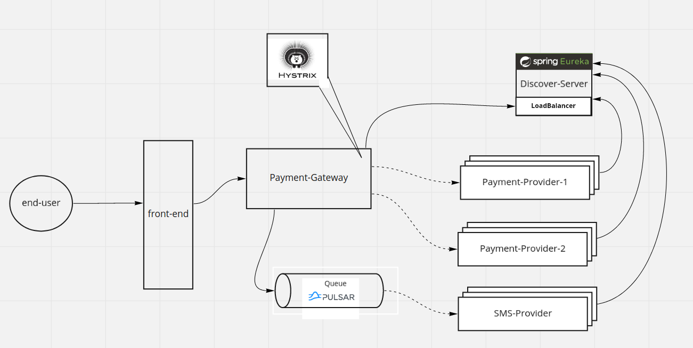

# Payment Gateway

### System Design

### Data Model
You can find datamodel(database schema) in [` payment-system/payment-gateway/deployment/database/migration/000001_base.up.sql` file](https://github.com/hamed-yousefi/payment-system/blob/main/payment-gateway/deployment/database/migration/000001_base.up.sql)

### Microservices
This project contains five services:
- payment-gateway: Core component of this system.
- discover-server: Responsible for service discovery, load balancing and service health check.
- payment-provider1: A payment provider for card transfers which source card number starts with `6307`.
- payment-provider1: A payment provider for card transfers which source card number can start with any number except `6307`.
- sms-provider: a service for sending SMS to users.
